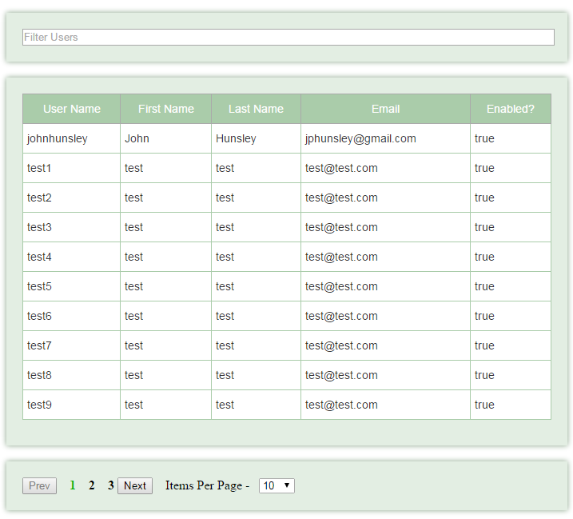

# vue-pager

> A Server Side Paging Vue Component with results filtering and adjustable page size and

## Build Setup

``` bash
# install dependencies
npm install johnhunsley/vue-pager

# serve with hot reload at localhost:8080
npm run dev

# build for production with minification
npm run build

# run unit tests
npm run unit

# run e2e tests
npm run e2e

# run all tests
npm test
```

## Properties

**colNames** - Names of the attributes of objects in the items array to display
Expects an array of mapping objects
which define a label and value attributes where the value is the exact name
of the attribute in item object to be displayed under the labelled column
header name.

``` javascript
 colNames: {
    type: Array,
    default () {
    return []
  }
 },
```

**response** - The response object from the server which must contain the following
       - pagedItems : An Array of objects with attributes referenced in colNames
       - totalItems : The total number of items to be paged
       - totalPages : The total number of pages as defined by the total items and page size
```javascript
response: {
      type: Object,
      default: null
    },
```

**onSearch** - A function which calls the remote service and sets the response. The function
should accept the pageSize and pageNumber as parameters
```javascript
onSearch: {
      type: Function,
      default (pageSize, pageNumber) {
      }
    },
```

**onSelect** - A function to execute when an item in the tabulated results is clicked
accepts the selectId property as a parameter
```javascript
onSelect: {
      type: Function,
      default (id) {
      }
    },
```

**selectId** - The name of the unique id of each item in the items array. Passed
into the onSelect function as a parameter
```javascript
 selectId: {
      type: String,
      default: ''
    }
  },
```
**pageSizeOptions** - An array containing the values and labels of the page size options
 ```javascript
  pageSizeOptions: {
       type: Array,
       default () {
         return ['5', '10', '20', '50', '100']
       }
     },
 ```
 **noItemsLabel** - Label to be displayed when no items are returned in the pagedItems value of
 the response
 ```javascript
     noItemsLabel: {
       type: String,
       default: 'No Results'
     },
 ```

**filterPlaceholder** - Input box place holder for the filter
 ```javascript
 filterPlaceholder: {
       type: String,
       default: 'Filter Results'
     },
 ```

## Example Usage

**Html**
```html
<pager :on-search='getRemoteItems' :on-select='editUser' :col-names='colNames' :response='response' :no-items-label='noUsers' :filterPlaceholder="filterUsers" :selectId='selectedId'/>
```

**Javascript**
```javascript
export default {

  components: {
    pager
  },

  data () {
    return {
      response: null,
      colNames: [
        {'label': 'User Name', 'value': 'username'},
        {'label': 'First Name', 'value': 'firstName'},
        {'label': 'Last Name', 'value': 'lastName'},
        {'label': 'Email', 'value': 'email'},
        {'label': 'Enabled?', 'value': 'enabled'}
      ],
      noUsers: 'No Users',
      filterUsers: 'Filter Users',
      selectedId: 'id'
    }
  },

  methods: {
    getRemoteItems: function (pageSize, pageNumber, filter) {
      console.log(pageSize + ' ' + pageNumber)
      this.$http.get('http://myuserservice.com/user/search/' + pageSize + '/' + pageNumber + '?query=' + filter)
        .then(function successCallback (response) {
          this.response = response
        }, function errorCallback (response) {
          console.log('error')
        })
    },

    editUser: function (id) {
      console.log('you clicked user ' + id)
    }
  }
}
```


